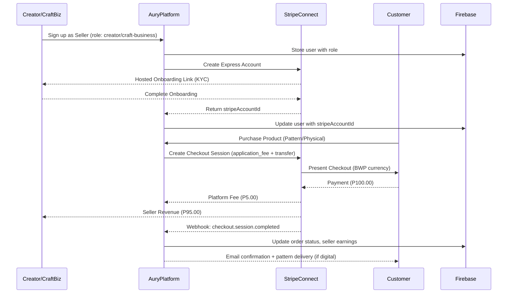

# 🏪 Aury Marketplace — Stripe Connect Integration

> Complete Stripe Connect architecture for Aury's dual-seller marketplace supporting both **creators** and **craft-businesses** with automatic commission splits and payouts.

---

## Executive Summary

* **Goal:** Enable seamless payments for Aury's marketplace where buyers purchase from creators (digital patterns) and craft-businesses (physical products), with automatic 5% platform commission.
* **Current State:** Basic Stripe Checkout implementation without seller revenue distribution.
* **Target Solution:** Implement **Stripe Connect (Express Accounts)** with automated splits, seller onboarding, and payout management.
* **Outcome:** Scalable, compliant payment flow that handles KYC, commission splits, and seller payouts automatically while supporting both digital and physical products.

---

## Architecture Overview (Mermaid)

```mermaid
flowchart LR
  subgraph BUYER[Customer]
    B[Customer Purchase\n(Pattern/Physical)]
  end

  subgraph AURY[Aury Platform]
    P[Next.js API Routes\n(Payment Processing)]
    F[Firebase Firestore\n(Orders, Earnings, Users)]
    W[Webhook Handler\n(/api/webhooks/stripe)]
    D[Seller Dashboard\n(Earnings & Onboarding)]
  end

  subgraph STRIPE[Stripe Infrastructure]
    C[Connect Express\n(Seller Onboarding)]
    CH[Checkout Session\n(Application Fee Split)]
    WH[Webhooks\n(Event Processing)]
  end

  subgraph SELLERS[Sellers]
    CR[Creators\n(Digital Patterns)]
    CB[Craft Businesses\n(Physical Products)]
    BA[Bank Accounts\n(Auto Payouts)]
  end

  B -->|Initiates Purchase| P
  P -->|Create Split Payment| CH
  CH -->|5% Platform Fee| P
  CH -->|95% to Seller| CR
  CH -->|95% to Seller| CB
  CR -->|Auto Payouts| BA
  CB -->|Auto Payouts| BA
  WH -->|Payment Events| W
  W -->|Update Records| F
  P --> D

  click C "https://dashboard.stripe.com/connect/accounts" "Stripe Connect Dashboard"
```

---

## Integration Flow: Seller Onboarding + Purchase



---

## Aury Architecture Components

| Component | Current Implementation | Stripe Connect Integration |
|-----------|----------------------|---------------------------|
| **Frontend** | React/Next.js with Stripe Checkout UI | Add seller onboarding flows, earnings dashboard |
| **API Routes** | `/api/payments` - basic checkout | Add `/api/stripe/connect`, `/api/stripe/webhooks` |
| **Database** | Firebase Firestore with existing schemas | Add `stripeAccountId` to users, enhance earnings tracking |
| **User Roles** | `creator`, `craft-business`, `customer` | Enable Connect onboarding for seller roles |
| **Payment Flow** | Single Stripe Checkout session | Split payments with application fees |
| **Seller Management** | Basic earnings tracking in Firebase | Real-time balance via Stripe Connect API |
| **Webhooks** | None currently | Process payment events, update earnings |

---

## Payment Flow Implementation (BWP Currency)

**Example Transaction:** Digital Pattern = **P100.00** (Botswana Pula)

1. **Platform Commission Calculation (5%)**
   ```javascript
   const productPrice = 100.00; // BWP
   const platformFeeRate = 0.05; // 5%
   const platformFee = productPrice * platformFeeRate; // P5.00
   const sellerRevenue = productPrice - platformFee; // P95.00
   ```

2. **Stripe Checkout Session Creation**
   ```javascript
   const session = await stripe.checkout.sessions.create({
     ui_mode: "embedded", // Current Aury implementation
     line_items: [{
       price_data: {
         unit_amount: 10000, // P100.00 in makoya (BWP minor unit)
         currency: "bwp",
         product_data: {
           name: product.name,
           images: product.imageUrl ? [product.imageUrl] : []
         }
       },
       quantity: 1
     }],
     payment_intent_data: {
       application_fee_amount: 500, // P5.00 in makoya (platform fee)
       transfer_data: { 
         destination: seller.stripeAccountId 
       }
     },
     mode: "payment",
     automatic_tax: { enabled: true },
     return_url: `${origin}/marketplace/paymentResult?session_id={CHECKOUT_SESSION_ID}`
   });
   ```

3. **Revenue Distribution**
   - **Platform receives:** P5.00 (application fee)
   - **Seller receives:** P95.00 (minus Stripe processing fees)
   - **Automatic transfer:** Funds route directly to seller's Connect account

---

## Implementation Code Examples

### 1. Seller Onboarding API Route

```typescript
// app/api/stripe/connect/route.ts
import { stripe } from "@/lib/stripe";
import { getCurrentUser } from "@/lib/actions/auth.action";
import { firebaseDb } from "@/firebase/admin";

export async function POST(request: Request) {
  try {
    const user = await getCurrentUser();
    if (!user || (user.role !== 'creator' && user.role !== 'craft-business')) {
      return Response.json({ error: 'Unauthorized' }, { status: 401 });
    }

    // Create Express Connected Account
    const account = await stripe.accounts.create({
      type: 'express',
      country: 'BW', // Botswana
      email: user.email,
      business_type: user.role === 'craft-business' ? 'company' : 'individual',
    });

    // Store account ID in Firebase
    await firebaseDb.collection('users').doc(user.id).update({
      stripeAccountId: account.id,
      stripeAccountStatus: 'incomplete',
      updatedAt: new Date()
    });

    // Create onboarding link
    const accountLink = await stripe.accountLinks.create({
      account: account.id,
      refresh_url: `${request.headers.get('origin')}/seller/onboarding/refresh`,
      return_url: `${request.headers.get('origin')}/seller/onboarding/complete`,
      type: 'account_onboarding',
    });

    return Response.json({ onboardingUrl: accountLink.url });
  } catch (error) {
    console.error('Connect account creation error:', error);
    return Response.json({ error: 'Failed to create account' }, { status: 500 });
  }
}
```

### 2. Enhanced Payment Route with Connect

```typescript
// app/api/payments/route.ts (Enhanced)
import { stripe } from "@/lib/stripe";
import { getCurrentUser } from "@/lib/actions/auth.action";
import { firebaseDb } from "@/firebase/admin";

export async function POST(request: Request) {
  try {
    const { productId } = await request.json();
    const user = await getCurrentUser();
    
    if (!user) {
      return Response.json({ error: "Authentication required" }, { status: 401 });
    }

    // Get product and seller info
    const productDoc = await firebaseDb.collection('products').doc(productId).get();
    if (!productDoc.exists) {
      return Response.json({ error: "Product not found" }, { status: 404 });
    }
    
    const product = { id: productDoc.id, ...productDoc.data() };
    
    // Get seller's Stripe account
    const sellerDoc = await firebaseDb.collection('users').doc(product.sellerId).get();
    const seller = sellerDoc.data();
    
    if (!seller?.stripeAccountId) {
      return Response.json({ error: "Seller not configured for payments" }, { status: 400 });
    }

    // Calculate fees
    const platformFeeAmount = Math.round(product.price * 100 * 0.05); // 5% in makoya

    const session = await stripe.checkout.sessions.create({
      ui_mode: "embedded",
      line_items: [{
        price_data: {
          unit_amount: product.price * 100, // Convert to makoya
          currency: "bwp",
          product_data: {
            name: product.name,
            images: product.imageUrl ? [product.imageUrl] : [],
            metadata: {
              productType: product.productType || 'physical',
              sellerId: product.sellerId
            }
          },
        },
        quantity: 1,
      }],
      payment_intent_data: {
        application_fee_amount: platformFeeAmount,
        transfer_data: { 
          destination: seller.stripeAccountId 
        },
        metadata: {
          productId,
          sellerId: product.sellerId,
          buyerId: user.id,
          productType: product.productType || 'physical'
        }
      },
      mode: "payment",
      automatic_tax: { enabled: true },
      metadata: {
        productId,
        sellerId: product.sellerId,
        buyerId: user.id
      },
      return_url: `${request.headers.get("origin")}/marketplace/paymentResult?session_id={CHECKOUT_SESSION_ID}`,
    });

    return Response.json({ 
      id: session.id, 
      client_secret: session.client_secret 
    });
  } catch (error) {
    console.error('Payment session creation error:', error);
    return Response.json({ error: "Payment setup failed" }, { status: 500 });
  }
}
```

---

### 3. Webhook Handler for Aury

```typescript
// app/api/webhooks/stripe/route.ts
import { stripe } from "@/lib/stripe";
import { firebaseDb } from "@/firebase/admin";
import { FieldValue } from 'firebase-admin/firestore';
import { headers } from "next/headers";

export async function POST(request: Request) {
  try {
    const body = await request.text();
    const headersList = headers();
    const sig = headersList.get('stripe-signature')!;

    let event;
    try {
      event = stripe.webhooks.constructEvent(
        body, 
        sig, 
        process.env.STRIPE_WEBHOOK_SECRET!
      );
    } catch (err: any) {
      console.error('Webhook signature verification failed:', err.message);
      return Response.json({ error: 'Invalid signature' }, { status: 400 });
    }

    switch (event.type) {
      case 'checkout.session.completed':
        await handleCheckoutCompleted(event.data.object);
        break;
      
      case 'account.updated':
        await handleAccountUpdated(event.data.object);
        break;
      
      case 'transfer.created':
        await handleTransferCreated(event.data.object);
        break;
    }

    return Response.json({ received: true });
  } catch (error) {
    console.error('Webhook processing error:', error);
    return Response.json({ error: 'Webhook processing failed' }, { status: 500 });
  }
}

async function handleCheckoutCompleted(session: any) {
  const { metadata, payment_intent, amount_total } = session;
  
  // Create order record
  const orderData = {
    userId: metadata.buyerId,
    items: [{
      productId: metadata.productId,
      quantity: 1,
      price: amount_total / 100, // Convert from makoya
      sellerId: metadata.sellerId,
      productType: metadata.productType
    }],
    totalAmount: amount_total / 100,
    status: 'paid',
    paymentIntentId: payment_intent,
    createdAt: FieldValue.serverTimestamp()
  };

  const orderRef = await firebaseDb.collection('orders').add(orderData);

  // Update seller earnings
  await updateSellerEarnings(metadata.sellerId, amount_total, orderRef.id);
  
  // Handle digital pattern delivery
  if (metadata.productType === 'pattern') {
    await deliverDigitalPattern(metadata.productId, metadata.buyerId);
  }
}

async function updateSellerEarnings(sellerId: string, totalAmount: number, orderId: string) {
  const platformFee = Math.round(totalAmount * 0.05);
  const sellerRevenue = totalAmount - platformFee;
  const netAmount = sellerRevenue / 100; // Convert to BWP

  // Create transaction record
  await firebaseDb.collection('transactions').add({
    orderId,
    sellerId,
    amount: sellerRevenue / 100,
    commission: platformFee / 100,
    netAmount,
    type: 'sale',
    status: 'completed',
    createdAt: FieldValue.serverTimestamp()
  });

  // Update seller earnings
  const earningsQuery = await firebaseDb
    .collection('seller_earnings')
    .where('sellerId', '==', sellerId)
    .limit(1)
    .get();

  if (earningsQuery.empty) {
    await firebaseDb.collection('seller_earnings').add({
      sellerId,
      totalEarnings: netAmount,
      availableBalance: netAmount,
      pendingBalance: 0,
      totalSales: sellerRevenue / 100,
      totalOrders: 1,
      commissionRate: 0.05,
      createdAt: FieldValue.serverTimestamp(),
      updatedAt: FieldValue.serverTimestamp()
    });
  } else {
    const earningsRef = earningsQuery.docs[0].ref;
    await earningsRef.update({
      totalEarnings: FieldValue.increment(netAmount),
      availableBalance: FieldValue.increment(netAmount),
      totalSales: FieldValue.increment(sellerRevenue / 100),
      totalOrders: FieldValue.increment(1),
      updatedAt: FieldValue.serverTimestamp()
    });
  }
}
```

---

## Firebase Schema Updates

### Enhanced User Schema
```typescript
// Existing users collection - add these fields
interface User {
  // ... existing fields
  stripeAccountId?: string;           // Connect account ID
  stripeAccountStatus?: 'incomplete' | 'pending' | 'enabled' | 'disabled';
  onboardingCompletedAt?: Date;
  payoutSchedule?: 'daily' | 'weekly' | 'monthly';
}
```

### Existing Collections (No Changes Needed)
Your current schemas already support Stripe Connect:

```typescript
// seller_earnings collection (already implemented)
interface SellerEarnings {
  id: string;
  sellerId: string;
  totalEarnings: number;
  availableBalance: number;      // Ready for Connect balance sync
  pendingBalance: number;
  totalSales: number;
  totalOrders: number;
  commissionRate: number;        // Already set to 0.05 (5%)
  lastPayoutAt?: string;
  createdAt: string;
  updatedAt: string;
}

// transactions collection (already implemented)
interface Transaction {
  id: string;
  orderId: string;
  sellerId: string;
  amount: number;
  commission: number;           // Platform fee tracking
  netAmount: number;           // Amount after commission
  type: 'sale' | 'refund' | 'payout';
  status: 'pending' | 'completed' | 'failed';
  paymentIntentId?: string;    // Link to Stripe PaymentIntent
  payoutId?: string;
  createdAt: string;
  processedAt?: string;
}

// orders collection (already implemented)
interface Order {
  // ... existing fields
  paymentIntentId?: string;    // Link to Stripe PaymentIntent
  paymentStatus: 'pending' | 'paid' | 'failed' | 'refunded';
}
```

---

## Next.js Integration with Existing Aury Structure

### New API Routes to Add

```
app/api/stripe/
├── connect/
│   └── route.ts              # Seller onboarding
├── webhooks/
│   └── route.ts              # Event processing
├── balance/
│   └── route.ts              # Get seller balance from Stripe
└── accounts/
    └── [accountId]/
        └── route.ts          # Account status updates
```

### Frontend Components to Enhance

```typescript
// components/creator/Sidebar.tsx (existing)
// Add onboarding status indicator
const SellerDashboard = () => {
  const [stripeAccountStatus, setStripeAccountStatus] = useState<string>();
  
  // Check if seller needs to complete onboarding
  if (stripeAccountStatus === 'incomplete') {
    return <OnboardingBanner />;
  }
  
  return <ExistingDashboard />;
};

// components/marketplace/PurchaseModal.tsx (existing)
// No changes needed - existing Stripe Checkout implementation works
```

### Environment Variables to Add

```bash
# .env.local
STRIPE_SECRET_KEY=sk_test_...
STRIPE_PUBLISHABLE_KEY=pk_test_...
STRIPE_WEBHOOK_SECRET=whsec_...
STRIPE_CLIENT_ID=ca_...        # For Connect onboarding
```

### Seller Onboarding Flow

1. **Creator/Craft-business signs up** → Existing auth flow
2. **First product creation** → Trigger Connect account creation
3. **Stripe onboarding** → Complete KYC via hosted flow
4. **Account verification** → Webhook updates account status
5. **Ready for sales** → Automatic payment splits activated

---

## Implementation Best Practices for Aury

### Multi-Seller Considerations
* **Digital vs Physical Products:** Patterns require instant delivery via email; physical products need shipping
* **Currency Handling:** BWP (Botswana Pula) with makoya as minor unit (1 BWP = 100 makoya)
* **Dual Seller Types:** Creators (individuals) vs Craft-businesses (companies) may have different tax requirements
* **Commission Consistency:** 5% platform fee across all seller types and product categories

### Performance & Reliability
* **Webhook Idempotency:** Use Stripe event IDs to prevent duplicate processing
* **Error Handling:** Graceful fallbacks for incomplete Connect accounts
* **Background Jobs:** Process heavy operations (email delivery, analytics) asynchronously
* **Rate Limiting:** Implement limits on Connect account creation attempts

### Security & Compliance
* **PCI Compliance:** Maintained through Stripe - never store card details
* **KYC/AML:** Handled by Stripe Connect for sellers
* **Data Protection:** Store only necessary Connect account IDs, not financial details
* **Audit Trail:** Complete transaction history via existing Firebase collections

### Business Rules
* **Minimum Payout:** P100 (already implemented in validation)
* **Payout Schedule:** Weekly automatic payouts via Stripe (configurable per seller)
* **Refund Policy:** Determine if platform or seller absorbs refund costs
* **Dispute Handling:** Leverage Stripe's dispute management system

---

## Security & Compliance

* **Webhook Security:** Verify all webhooks with your webhook secret using `stripe.webhooks.constructEvent`
* **Access Control:** Leverage existing Firebase Auth and role-based permissions (`creator`, `craft-business`, `customer`)
* **Data Minimization:** Store only `stripeAccountId` - never store financial details or bank information
* **TLS/HTTPS:** All communications encrypted (already implemented in Next.js deployment)
* **API Key Management:** Rotate Stripe API keys periodically, use environment variables
* **Error Logging:** Implement comprehensive logging for Connect operations and webhook failures

---

## Implementation Roadmap for Aury

### Phase 1: Foundation (Week 1-2)
* [ ] Enable Stripe Connect in dashboard and configure webhooks
* [ ] Create `/api/stripe/connect` route for seller onboarding
* [ ] Add `stripeAccountId` field to Firebase users collection
* [ ] Implement Connect account creation for new sellers

### Phase 2: Payment Integration (Week 2-3)
* [ ] Enhance existing `/api/payments/route.ts` with application fees and transfers
* [ ] Create `/api/webhooks/stripe/route.ts` for event processing
* [ ] Update checkout flow to handle Connect payments
* [ ] Test payment splits with test accounts

### Phase 3: Seller Experience (Week 3-4)
* [ ] Build seller onboarding UI components
* [ ] Enhance earnings dashboard with real-time Stripe data
* [ ] Implement Connect account status checking
* [ ] Add onboarding completion flows

### Phase 4: Operations & Monitoring (Week 4-5)
* [ ] Set up webhook failure monitoring and alerts
* [ ] Implement payout reconciliation with existing system
* [ ] Add dispute and refund handling workflows
* [ ] Performance testing with multiple sellers

### Phase 5: Launch Preparation (Week 5-6)
* [ ] Security audit of Connect implementation
* [ ] Documentation for seller onboarding process
* [ ] Compliance review for Botswana market
* [ ] Go-live with graduated rollout

---

**Migration Strategy:** Implement alongside existing payment system, gradually migrate sellers to Connect accounts, maintain backward compatibility during transition.
